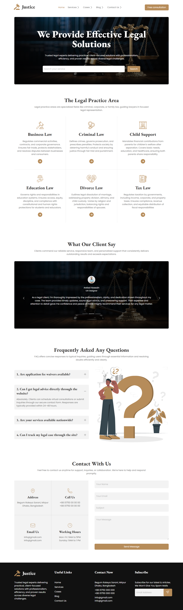
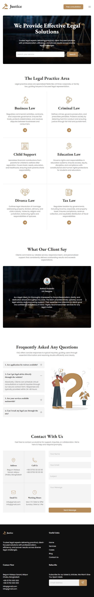

# Legal Solution

Trusted legal experts delivering practical, client-focused solutions
with professionalism, efficiency, and proven results across diverse
legal challenges.

## Table of Contents

- [Run it Locally](#run-it-locally)
- [Screenshots](#screenshots)
- [Necessary Links](#necessary-links)
- [Credit](#credit)

## Run it Locally

Please follow the below instructions to run this project in your machine:

1. Clone this repository

   ```sh
       git clone https://github.com/sagormajomder/legal-solution.git
   ```

2. Open the directory "legal-solution" into visual studio code and contribute
3. Install`live server` extension on vscode and run to see the project in browser

The project will be available on http://127.0.0.1:5500/ by default.

## Screenshots

### Desktop



### Tablet



### Mobile


## Necessary Links

- Repository link: [Legal Solution repository](https://github.com/sagormajomder/legal-solution)
- App live link : [Legal Solution live](https://sagormajomder.github.io/legal-solution/)

## Credit

It is designed by [Programming Hero](https://github.com/ProgrammingHero1)
